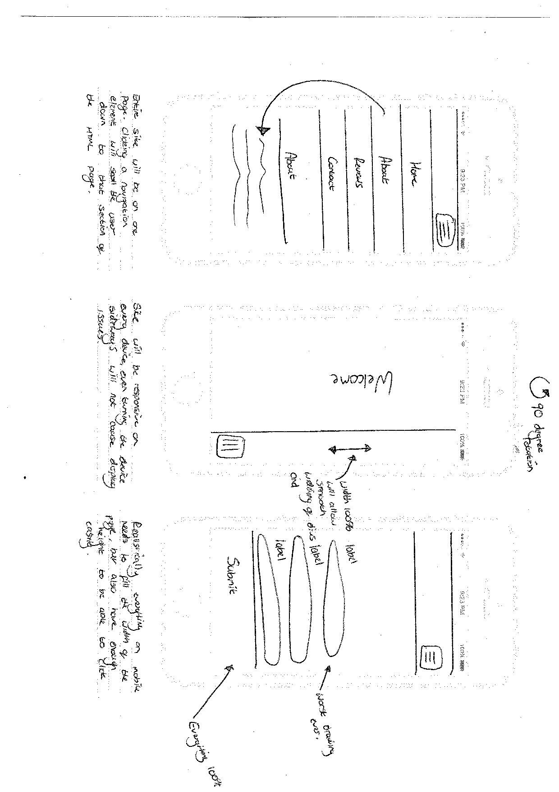
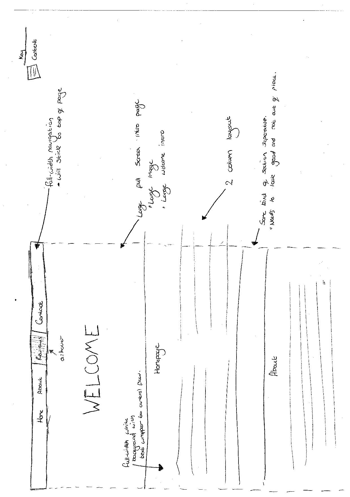
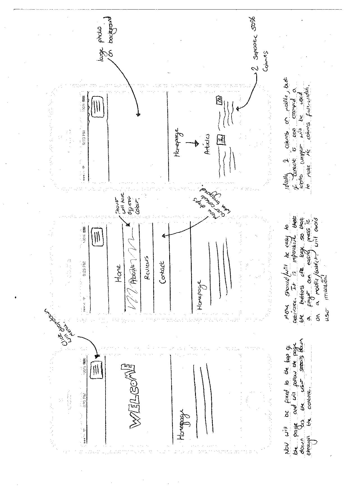

# CTEC3905

This repository was created to complete the coursework for the CTEC3905 Front-end Web Development Module at Demontfort University. The website was developed using HTML5, CSS3 and Javascript. The website was initially designed with wireframes, then designed in a Adobe Photoshop .psd file, then finaly converted into pure code. 
## Wireframe Designs

### Wireframe 1


### Wireframe 2


### Wireframe 3


## Site Map
```
<?xml version="1.0" encoding="UTF-8"?>
<urlset
      xmlns="http://www.sitemaps.org/schemas/sitemap/0.9"
      xmlns:xsi="http://www.w3.org/2001/XMLSchema-instance"
      xsi:schemaLocation="http://www.sitemaps.org/schemas/sitemap/0.9
            http://www.sitemaps.org/schemas/sitemap/0.9/sitemap.xsd">

<url>
  <loc>https://kissanealex.github.io/CTEC3905/</loc>
  <lastmod>2017-12-29T23:17:04+00:00</lastmod>
</url>

<url>
  <loc>https://kissanealex.github.io/CTEC3905/#homepage</loc>
  <lastmod>2017-12-29T23:17:04+00:00</lastmod>
</url>

<url>
  <loc>https://kissanealex.github.io/CTEC3905/#reviews</loc>
  <lastmod>2017-12-29T23:17:04+00:00</lastmod>
</url>
  
<url>
  <loc>https://kissanealex.github.io/CTEC3905/#newsarticles</loc>
  <lastmod>2017-12-29T23:17:04+00:00</lastmod>
</url>

<url>
  <loc>https://kissanealex.github.io/CTEC3905/#about</loc>
  <lastmod>2017-12-29T23:17:04+00:00</lastmod>
</url>

<url>
  <loc>https://kissanealex.github.io/CTEC3905/#contact</loc>
  <lastmod>2017-12-29T23:17:04+00:00</lastmod>
</url>

</urlset>
```

## CSS Development
  The CSS Development of this website was created using the following strcuture.
- Structure
- Skin
- Content

### Used Breakpoints

`@media (min-width: 768px) and (max-width: 1024px)`

`@media (min-width: 600px) and (max-width: 767px)`

`@media (min-width: 0px) and (max-width: 600px)`

### Nice Features

#### Transitions
The transition on the navigation is only a little feature but allows a sophisticated change between no background colour to the hover colour of blue.
`transition: background-color 0.5s ease;`

#### Keyframes
The following code allows the arrow at the bottom of the screen to bounce smoothly and looks fantastic. This is done using keyframes as shown below. Booming tricky!
```
.bounce {
 animation: bounce 2s infinite;
 -webkit-animation: bounce 2s infinite;
 -moz-animation: bounce 2s infinite;
 -o-animation: bounce 2s infinite;
}

@keyframes bounce {
 0%, 20%, 50%, 80%, 100% {transform: translateY(0);}
 40% {transform: translateY(-30px);}
 60% {transform: translateY(-15px);}
}
```


## HTML Development

The website was developed with a basic, modern design in mind. The website is a single-page site that has a modern sleek design. Using a combination of flat colours, the modern-looking square design with no curves, and a full-page-width design has allowed a website that is not only easy to navigate, but also extremely basic and easy to use. Content is easily available to read without annoying popups and having to wait for images to load.

## Javascript Development

### Contact Page Alert

When clicking on the submit button on the index the user is alerted via Javascript with a box statement explaining when they will receive an answer.
```
if(document.getElementById("Submit")){
  document.getElementById("Submit").addEventListener("click", alertContact);
}

function alertContact() {
  window.alert("Thank you for getting in touch. We will be back with you shortly. (Usually 24-48 hours)");
}
```
### Google Maps API

Google maps API was implemented to show the location of the GameHUB headoffice. An API key had to be generated for the ability of the website being able to contact and communicate with the Google Application.
## User Testng

A thorough test was conducted to ensure that the website in question was easy to use on both an iPhone 7, iPad Air, a Laptop and a Desktop Computer.

A test was conducted using 4 different individuals. Each individual was given access to the website on each of the devices shown above. The 4 individuals were then asked to write down their comments on the site on a peice of paper, whether they were positive or negative.

### Individual 1

	- Website looks nice
	- Works well on phone
	- Buttons are easy to click
	- Colour combination is a little difficult to see. *This has now been addressed with the change of colour contrast.

### Individual 2

	- Looks ok
	- Strange that the page doesn't move
	- Looks modern

### Individual 3

	- Mobile menu is easy to use
	- Looks modern
	- Would like font to be bigger *User was visually challenged, so in this case making the font larger would be better for usage, but would compromise design.

### Individual 4

	- iPad version of the website is easy to use
	- Loads fast
	- Looks cool

## References

### Fonts used

Google Fonts is a brilliant resource in which has made the typography on this website excell from Times New Roman or Helvetica!

- Lato
- Bungee
- Press Start 2P
- Passion One

### Sources used

#### Background Image
Unknown, (2016), *Wallpapers and Gaming* [ONLINE]. Available at: http://tianyihengfeng.com/wp-content/uploads/2016/06/wallpapers-gaming.jpg [Accessed 20 December 2017].

#### Wireframe iphone layout
Anthony, G. (2013). *iPhone 5S Template.* Available: https://dribbble.com/shots/1310163-iPhone-5S-Template. Last accessed 26th Dec 2017.

### Google Maps API Help
Unknown. (2017). *Google Maps Tutorial.* Available: https://www.w3schools.com/graphics/google_maps_intro.asp. Last accessed 29th Dec 2017.